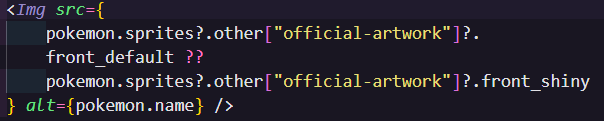
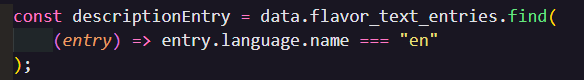
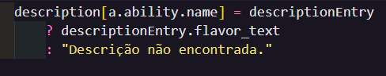
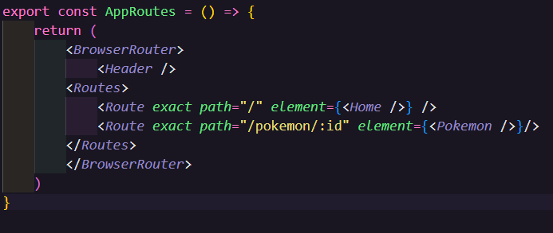

## Projeto Pokemon 

    Projeto feito em react onde é feita uma busca de pokemons através da api https://pokeapi.co/.

# Objetivo do projeto

    Colocar em prática todo conhecimento absorvido no módulo avançado de react, no qual a tarefa era criar uma aplicação SPA (Single Page Application), com um header com botão de ateração de tema e um botão para voltar ao home quando navegar para dentro da descrição do pokemon selecionado, o home com uma lista inicial de 10 pokemons onde apareceria imagem e nome do mesmo.
    Ao selecionar o pokemon o usuário é direcionado para uma página onde mostra mais informaões do pokemon como tipo, lista de habilidades que deixei com um numero específico de 2 habilidades e uma lista específico de 4 movimentos por pokemon.

# Ferramentas utilizadas

    -Html | CSS | REACT | VITE |

# Decisões tomadas durante o planejamento

    Para realização desse projeto não houve um layot e design para seguir de base, foi deixado para usar a minha própria criatividade, optei por começar pelo home buscando a lista dos 10 pokemons, para isso criei uma pasta de services de onde seria buscado essa lista, para fazer essa busca decidi usar o Axios por ser fácil de uasr com código assincrono, ser um código limpo e legivel e porque aprendi sobre ele a pouco tempo assim me adapto mais rapido com ele.
    Essa Pasta services é onde é feita a busca da lista dos pokemons com parâmetro inicial de 0 e com outro parâmetro de 10 que foi a quantidade a ser buscada, e a busca por id de cada pokemon quando selecionado.
    Para fazer a busca da propriedade de imagem do pokemon tive que acessa-la como uma string dentro do objeto, porque o JS entenderia official-artwork como uma operação matemática e não como um nome de propriedade.

    

    Importado Link do react-router-dom, styled components, useContext(ThemeContext).

    No component de PokemonsDetals um método que foi muito útil foi o .find(), onde utilizei para me retorna apenas um elemento de satisfazia minha condição que era o "en", porque .find() ao invés de .filter(), porque nessa situação o find evitou mais código, deixando um código mais limpo, o filter iria me retorna um array com todas descrições em "en" mas o find me retorna o primeiro objeto que corresponde e para a busca imediatamente.

    

    O uso de um objeto DINÂMICO foi muito eficiente, usei a chave a.ability.name como uma chave dinâmica no objeto description, mas esse valor atribuido depende se descriptionEntry existe ou não. Com isso evitei código manual e repetitivo, adapta a qualquer numero de habilidade automaticamente e o código facilita a manutenção e escabilidade do código.

    

    No arquivo routes.jsx da pasta pages, deixei o header por fora do Routes porque eu quero que meu header fique presente em todos minhas páginas, dessa forma náo preciso importa em cada pagina meu header.

    

    Utilizei import { ThemeProvider as StyledThemeProvider } from "styled-components"; para deixar meu código mais limpo e mais facil de dar manutenção.

# Passo a passo de como rodar o projeto na sua maquina. 

    Pode ser feito um clone ou um fork https://github.com/Tiago-SilvaRP/pokemon-react, abra o VS Code, caso use outro editor de codigo-fonte pode utiliza-lo também, certifique-se de ter o Node.js instalado, baixe o pacote de dependências pelo terminal npm install, para acessar link do projeto digite npm run dev no terminal que ira aparecer o link do projeto, para seguir o link (segure crtl + clique).

# Gif funcionamento do Projeto

    

# Autor 

    https://github.com/Tiago-SilvaRP (Tiago Silva).

# Agradecimentos 

    Toda equipe Dev em Dobro e https://pokeapi.co/ por disponibilizar a API.